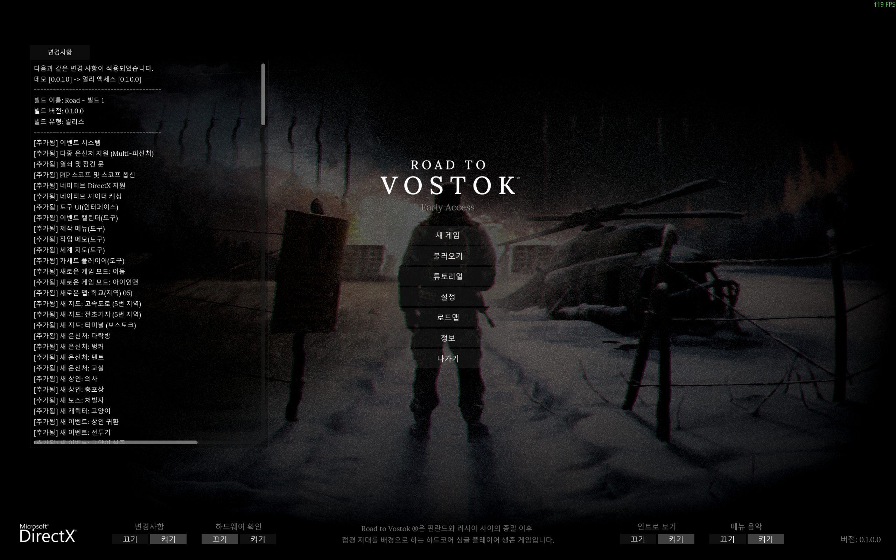
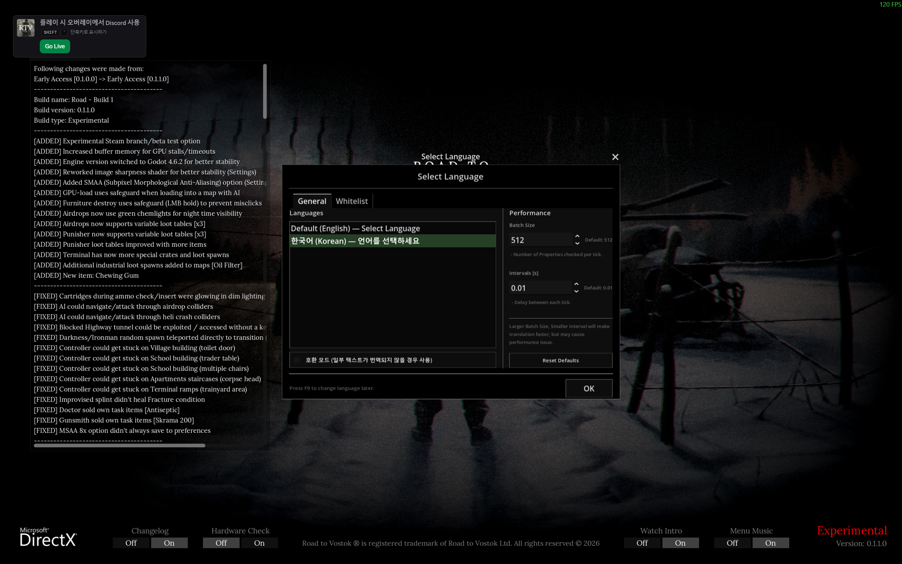
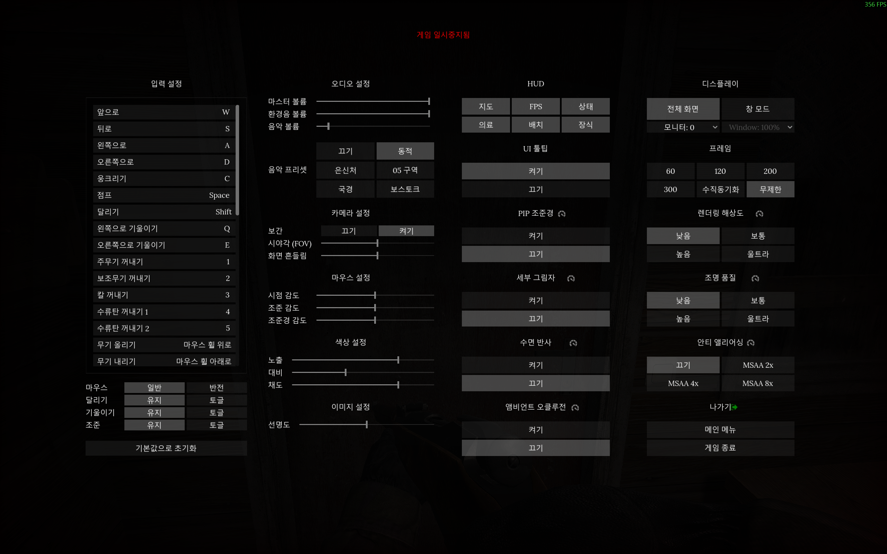
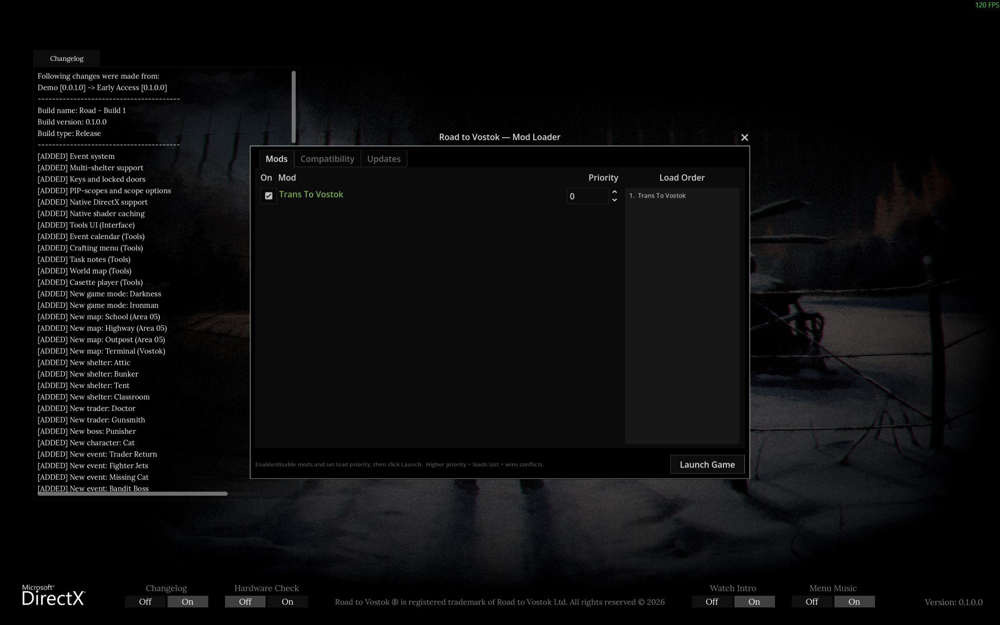

# Trans To Vostok

A multilingual translation mod for Road to Vostok.

> **NOTE:** *This mode is currently under development. .*

- Currently supported languages: **English** (game default), **Korean** (in development)
- Development is focused on Korean translation and the ToolBox first.
- Detailed manuals and the ToolBox will be published on GitHub once development reaches a sufficient milestone.

## 1. Introduction

**Trans To Vostok** is a mod under development to support multilingual localization for Road to Vostok.
It aims to deliver **complete, non-missing translation** across all translatable game content — UI, items, quests, interactions, and more.

## 2. Key Features

1. **Game Translation** (core feature)
   - Translates in-game UI, tooltips, item names, event descriptions, trader dialogue, and more.
2. **UI Support**
   - Opens a language selection UI via **`F9`** hotkey when the mod is loaded.
   - Switch languages at runtime without restarting the game.
   - Compatibility mode toggle provided (see below).
3. **Text Position Realignment**
   - When translation changes text length, **on-screen layout can shift** (e.g., `A: B` layouts like tooltip's "Weight: 0.8kg").
   - This mod measures the translated label's actual font width and auto-adjusts the Value node's offset.
     - Targets: `Label` nodes with a child `Value` Label (manual positioning)
     - Auto-aligns "label: [value]" patterns in Tooltip, inventory stats, etc.
     - **Disabled in Compatibility Mode** — avoids interfering with game scene structure.
4. **1:1 Property-Based Translation** (Precision Matching)
   - Instead of simple text substitution, translation targets are specified directly via **Godot node structural identifiers**:
   - ``(location, parent, name, type, text) → translation``
     - `location`: Scene file path (e.g., `UI/Interface`)
     - `parent`: Parent node path within the scene (e.g., `Tools/Notes`)
     - `name`: Node name (e.g., `Hint`)
     - `type`: Godot node class (e.g., `Label`)
     - `text`: Original source text
   - **The same word can be translated differently depending on which UI/node it appears in** — prevents mismatches, enables context-aware translation.
     - Example: NVG (Night Vision Goggle) can show the full name in settings but "NVG" everywhere else.
5. **N-Tier Fallback Matching**
   - Looks up translations through 9 tiers, from specific context to generic substitution:
   - Current implementation (subject to change):| Tier | Match Method                                 | Notes                                |
     | ---- | -------------------------------------------- | ------------------------------------ |
     | 1    | **static exact** — all 5 fields match | All fields match exactly             |
     | 2    | **scoped literal exact**               | Dynamic text (runtime assignment)    |
     | 3    | **scoped pattern exact**               | Regex + scene context                |
     | 4    | **literal global**                     | Full text match (global)             |
     | 5    | **pattern global**                     | Regex (global)                       |
     | 6    | **static score**                       | Partial context match (+8/+4/+2/+1)  |
     | 7    | **scoped literal score**               | Dynamic text, partial context        |
     | 8    | **scoped pattern score**               | Regex + partial context              |
     | 9    | **substr**                             | Substring substitution (last resort) |
6. **Compatibility Mode**
   - **Temporary fallback when game updates break matching structure.**
   - Treats all translation data as **sub-strings (dictionary)** via substring substitution.
   - Lower precision, but largely unaffected by scene structure changes.
   - Lets players keep using translations until the mod is updated.
   - Toggle on/off via checkbox in the F9 UI.
7. **Image / Texture Translation** (added in v0.3.0)
   - Game textures can be replaced with localized versions at runtime — sprites, Sprite3D, and MeshInstance3D ShaderMaterial `sampler2D` parameters.
   - Scans `<locale>/textures/` recursively; paths mirror the original `res://` layout.
   - Missing files are silently skipped — original texture is kept, no crash.
   - Originals are restored on language switch (mirrors the text translator lifecycle).
   - First shipped set: Korean **Tutorial Billboard** textures (17 images).
   - **Note**: Translated textures were hand-crafted (reconstructed), and may include hand-drawn work and/or copyright-free assets, so some icons may differ slightly from the originals (e.g., Performance icon, Permadeath skull icon on the Tutorial Billboards).
8. **Priority Whitelist** (added in v0.3.1)
   - Optional path-keyword presets that force per-frame priority translation for specific UI areas (HUD map label, inventory, trader UI, etc.).
   - Intended for mod compatibility — when another mod periodically overwrites in-game text (e.g., ImmersiveXP overriding `HUD.gd._physics_process` causes map-name flicker), enabling the relevant preset eliminates the flicker.
   - All presets default OFF. Toggle via the **Whitelist** tab in the F9 UI. Per-preset state persists to `user://trans_to_vostok.cfg`.

## 3. Installation

> **NOTE:** This mod requires a mod loader such as MetroModLoader.

1. Install **MetroModLoader** or **VostokMods** for Godot: https://modworkshop.net/mod/55623
2. Download `Trans To Vostok.zip` and copy it into the game's `mods/` folder.
   e.g., `C:\Program Files (x86)\Steam\steamapps\common\Road to Vostok\mods\`
   or: `D:\SteamLibrary\steamapps\common\Road to Vostok\mods\`
3. Launch the game — it starts in the default language (English).
4. Press **F9** to open the language selection UI and switch to your preferred language.

## 4. Supported Languages

1. **English**: The game's default language.
2. **Korean (한국어)**: Currently in development/testing.
3. Other languages will be supported gradually after the ToolBox development is complete.

To request additional languages, please submit a GitHub issue (to be published).

## 5. TODO (Roadmap)

### 5.1. Feature Implementation

* [X] Runtime translation engine prototype (N-tier fallback)
* [X] Prototype development targeting game version 1.0.0
* [X] Language selection UI added
* [X] Text position realignment added
* [X] Compatibility mode added
* [X] Performance options added to UI (added in v0.2.0)
* [X] Partial image replacement support — runtime texture loader + Korean Tutorial billboards (added in v0.3.0)
* [X] Priority whitelist — per-frame translation presets for mod compatibility, F9 UI toggles (added in v0.3.1)
* [ ] Testing current mod build against game 1.0.0 (in progress)
* [ ] Texture metadata list + validation (TODO carried over from v0.3.0)
* [ ] User-custom whitelist keyword input for unverified mods (TODO carried over from v0.3.1)
* [ ] Translator optimization
* [ ] Debug mode (planned)

### 5.2. Translation Support

* [X] Complete translation template based on Korean
* [ ] After template cleanup, provide temporary machine-translated support for other languages
* [ ] Publish translation ToolBox prototype on GitHub
* [ ] Recruit translators or collaborate via GitHub
* [ ] Publish ToolBox and manual prototype on GitHub
* [ ] Create branches for additional languages (French, Japanese, Chinese, German, etc.)
* [ ] Design translation workflow for stable / beta game branches (version-specific diffs, release tagging, side-by-side maintenance)

---

## Developer/Translator's ToolBox (Not released yet)

The mod repository includes **Python tools** for the translation pipeline:

| Tool                            | Role                                                      |
| ------------------------------- | --------------------------------------------------------- |
| `set_requirements.py`         | Bootstrap: install pip deps + download `gdre_tools`     |
| `unpack_and_decompile_pck.py` | Decompile the game PCK file                               |
| `extract_tscn_text.py`        | Extract translatable text from `.tscn` scene files      |
| `extract_tres_text.py`        | Extract text from `.tres` resource files                |
| `extract_gd_text.py`          | Extract UI strings from `.gd` scripts                   |
| `check_untranslated.py`       | Translation gap / coverage report                         |
| `check_duplicate.py`          | Pre-build duplicate key detector (xlsx-only)              |
| `check_conflict.py`           | Conflict check (same source text, different translations) |
| `check_old_translation.py`    | Detect stale translations from removed game content       |
| `validate_translation.py`     | xlsx schema / duplicate / match validation                |
| `build_runtime_tsv.py`        | Build runtime TSV from xlsx                               |
| `build_mod_package.py`        | Build final mod zip package (incl.`textures/`)          |

**Detailed ToolBox manual will be published on GitHub after development is complete.**

---

## Technical Structure

- **Runtime text engine**: `translator.gd` (GDScript autoload)
- **Runtime texture engine**: `texture_loader.gd` (GDScript, lifecycle-managed by `translator_ui.gd`)
- **UI**: `translator_ui.gd` (language selection UI triggered by F9)
- **Text data**: `<locale>/translation_*.tsv` (built from xlsx)
- **Image data**: `<locale>/textures/**/*.png` (mirrors `res://` layout)
- **Matching approach**: 1:1 mapping based on Godot node structure (see the header comment in [`translator.gd`](translator.gd) for details)

## License

To be specified upon GitHub publication.

## Contact

Please reach out via GitHub issues (to be published) or the mod distribution channel.

========================================

# Trans To Vostok

Road to Vostok의 다국어 번역 지원 모드.

> **NOTE:** *해당 모드는 현재 개발중에 있습니다.*

- 현재 지원 언어: **English** (게임 기본언어), **Korean** (개발 중)
- 한국어를 대상으로 개발 및 ToolBox를 우선 개발 중입니다.
- 개발이 어느 정도 완료되면 GitHub에 자세한 메뉴얼과 ToolBox 등을 공개할 예정입니다.

## 1. 소개

**Trans To Vostok**는 Road to Vostok의 다국어 지원을 위해 개발 중인 모드입니다.
UI, 아이템, 퀘스트, 상호작용 등 **게임 내 번역 가능한 부분을 누락 없이 최대한 무결성 번역**하는 것을 목표로 합니다.

## 2. 주요 기능

1. 게임 번역 (기본 기능)
   - 게임 내 UI, 툴팁, 아이템 이름, 이벤트 설명, 트레이더 대사 등을 번역합니다.
2. UI 지원
   - 모드 로드 시 **단축키 `F9`** 로 언어 선택 UI 표시
   - 게임 재시작 없이 런타임에 언어 전환 가능
   - 호환성 모드 토글 제공 (아래 참고)
3. 문자 위치 재정렬
   - 번역으로 텍스트 길이가 달라질 경우 **실제 화면 위치가 어긋날 수 있습니다** (예: 툴팁의 "Weight: 0.8kg" 같은 `A: B` 레이아웃).
   - 해당 모드는 번역된 라벨의 실제 폰트 너비를 측정하여 Value 노드의 offset을 자동 재조정을 지원합니다.
     - 대상: `Label` 노드 + 자식 `Value` Label (수동 위치)
     - Tooltip, 인벤토리 스탯 등의 "라벨: [값]" 패턴 자동 정렬
     - **호환성 모드에서는 비활성** — 게임 씬 구조에 간섭하지 않음
4. 게임 내 property와 1대1 매칭 번역 (정밀 매칭)
   - 단순 text 치환이 아니라 **Godot 노드의 구조적 식별자**로 번역 대상을 직접 지정합니다:
   - ``(location, parent, name, type, text) → translation``
     - `location`: 씬 파일 경로 (예: `UI/Interface`)
     - `parent`: 씬 내 부모 노드 경로 (예: `Tools/Notes`)
     - `name`: 노드 이름 (예: `Hint`)
     - `type`: Godot 노드 클래스 (예: `Label`)
     - `text`: 원문
   - **같은 단어라도 어느 UI의 어느 노드에 있는지에 따라 다르게 번역** 가능 — 오매칭 방지, 문맥별 번역 지원.
     - 예: NVG(Night Vision Goggle의 경우, 설정에서는 Full Name을, 그 외에는 NVG을 표시)
5. N-Tier Fallback 매칭
   - 구체적인 컨텍스트부터 일반 치환까지 9단계로 조회합니다:
   - 현재 구현 방식 (수정될 수 있음)| Tier | 매칭 방식                                 | 비고                             |
     | ---- | ----------------------------------------- | -------------------------------- |
     | 1    | **static exact** — 5개 필드 완전 일치 | 모든 필드가 완벽하게 일치        |
     | 2    | **scoped literal exact**            | 동적 텍스트 (코드 할당)          |
     | 3    | **scoped pattern exact**            | 정규식 + 씬 컨텍스트             |
     | 4    | **literal global**                  | 텍스트 완전 일치 (전역)          |
     | 5    | **pattern global**                  | 정규식 (전역)                    |
     | 6    | **static score**                    | 부분 컨텍스트 매칭 (+8/+4/+2/+1) |
     | 7    | **scoped literal score**            | 동적 텍스트 부분 컨텍스트        |
     | 8    | **scoped pattern score**            | 정규식 + 부분 컨텍스트           |
     | 9    | **substr**                          | 부분 문자열 치환 (최후 fallback) |
6. 호환성 모드 (Compatibility Mode)
   - **게임 업데이트로 매칭 구조가 깨졌을 때 임시 대응용.**
   - 모든 번역 데이터를 **sub-string(사전) 취급**하여 부분 문자열 치환으로 동작
   - 정밀도는 낮지만 씬 구조 변경에 크게 영향받지 않음
   - 개발자가 모드를 업데이트하기 전까지 플레이어가 번역을 계속 사용할 수 있음
   - F9 단축키를 통해 UI에서 체크박스로 on/off 가능
7. 이미지 / 텍스처 번역 (v0.3.0에서 추가)
   - 게임 텍스처를 로케일별 번역본으로 런타임에 교체 — 스프라이트, Sprite3D, MeshInstance3D 의 ShaderMaterial `sampler2D` 파라미터 지원.
   - `<locale>/textures/` 디렉토리를 재귀 스캔. 경로는 원본 `res://` 구조를 그대로 미러링.
   - 번역 파일이 없으면 조용히 스킵 — 크래시 없이 원본 텍스처 유지.
   - 언어 전환 시 원본 복원 (텍스트 translator 와 동일한 라이프사이클).
   - 최초 적용: 한국어 **튜토리얼 빌보드** 텍스처 17장.
   - **참고**: 번역 텍스처는 수작업으로 재구성(hand-crafted)되었으며, 직접 그린 작업물(hand-drawing) 또는 저작권이 없는 애셋이 포함될 수 있어 일부 아이콘이 원본과 조금 다를 수 있음 (예: 튜토리얼 빌보드의 Performance 아이콘, Permadeath 해골 아이콘 등).
8. 우선 순위 화이트리스트 (v0.3.1에서 추가)
   - 특정 UI 영역(HUD 맵 이름, 인벤토리, 트레이더 UI 등)을 매 프레임 번역으로 승격시키는 경로 키워드 프리셋을 선택적으로 활성화할 수 있습니다.
   - 모드 호환성을 위한 기능 — 다른 모드가 게임 텍스트를 주기적으로 덮어쓰는 경우(예: ImmersiveXP 의 `HUD.gd._physics_process` 오버라이드로 맵 이름이 깜빡이는 현상), 해당 프리셋을 활성화하면 깜빡임이 사라집니다.
   - 모든 프리셋은 기본 OFF. F9 UI 의 **Whitelist** 탭에서 토글하며, 상태는 `user://trans_to_vostok.cfg` 에 저장됩니다.

## 3. 설치

> **NOTE:** 해당 모드는 MetroMoadLoader 등의 모드로더를 요구합니다.

1. Godot용 **MetroModLoader** 또는 **VostokMods**가 설치되어 있어야 합니다. https://modworkshop.net/mod/55623
2. `Trans To Vostok.zip` 파일을 다운로드 받은 후, 게임의 `mods/` 폴더에 복사합니다.
   예: `` C:\Program Files (x86)\Steam\steamapps\common\Road to VostokTrans To Vostok\mods\``
   또는: ``D:\SteamLibrary\steamapps\common\Road to Vostok\mods\``
3. 게임을 실행하면 기본 언어(English)로 시작됩니다.
4. **F9** 키로 언어 선택 UI를 열어 원하는 언어로 전환합니다.

## 4. 지원 언어

1. English: 게임의 기본 언어입니다.
2. 한국어(Korean): 현재 개발/테스트 중인 언어입니다.
3. 그 외 다른 언어는 ToolBox에 대한 개발이 완료된 후, 천천히 지원해 나갈 계획입니다.

추가 언어 지원을 원하시면 GitHub 이슈로 요청해 주세요. (차후 공개 예정)

## 5. TODO (로드맵)

### 5.1. 기능 구현

* [X] 런타임 번역 엔진 프로토타입 임시 구현 (N-tier fallback)
* [X] 1.0.0 버전을 대상으로 번역 모드 Prototype 개발
* [X] 언어 선택 UI 추가
* [X] 문자 위치 재정렬 기능 추가
* [X] 호환성 모드 추가
* [X] UI에 성능 옵션 추가 (v0.2.0에 추가됨)
* [X] 일부 이미지 교체 기능 — 런타임 텍스처 로더 + 한국어 튜토리얼 빌보드 (v0.3.0에 추가됨)
* [X] 우선 순위 화이트리스트 — 모드 호환용 매 프레임 번역 프리셋, F9 UI 토글 (v0.3.1에 추가됨)
* [ ] 현재 개발된 모드를 게임 1.0.0 버전에 대한 테스트 (진행 중)
* [ ] 텍스처 메타데이터 리스트 + 검증 도구 업데이트 (v0.3.0 에서 추가된 TODO)
* [ ] 확인되지 않은 모드에 대응할 수 있도록 사용자 커스텀 whitelist 키워드 입력 (v0.3.1 에서 추가된 TODO)
* [ ] 번역기 최적화
* [ ] 디버그 모드 추가 (예상)

### 5.2. 번역 지원

* [X] Korean 번역을 기준으로 번역 템플릿 완성
* [ ] 번역 Template 정리 후, 기계번역 등을 이용해 다른 언어에 대한 임시 지원 추가
* [ ] 번역 ToolBox 프로토타입 GitHub 공개 및 관리
* [ ] 번역가 모집 또는 GitHub를 통한 협업
* [ ] ToolBox 및 메뉴얼 Prototype 완성 후 GitHub 공개
* [ ] 추가 언어 지원  Branch 생성 (프랑스어, 일본어, 중국어, 독일어 등)
* [ ] 정식 / 베타 버전에 대한 번역 workflow 설계 (버전별 diff, 릴리스 태깅, 양쪽 동시 유지)

---

## 개발자/번역가용 ToolBox (아직 공개 안됨)

모드 저장소에는 번역 파이프라인 구축용 **Python 도구**가 포함되어 있습니다:

| 도구                            | 역할                                                      |
| ------------------------------- | --------------------------------------------------------- |
| `set_requirements.py`         | 부트스트랩: pip 의존성 설치 +`gdre_tools` 자동 다운로드 |
| `unpack_and_decompile_pck.py` | 게임 PCK 파일 디컴파일                                    |
| `extract_tscn_text.py`        | `.tscn` 씬 파일에서 번역 대상 텍스트 추출               |
| `extract_tres_text.py`        | `.tres` 리소스 파일에서 텍스트 추출                     |
| `extract_gd_text.py`          | `.gd` 스크립트에서 UI 문자열 추출                       |
| `check_untranslated.py`       | 번역 누락/커버리지 리포트                                 |
| `check_duplicate.py`          | 빌드 전 중복 키 사전 검사 (xlsx 단독)                     |
| `check_conflict.py`           | 번역 충돌 검사 (같은 원문 다른 번역)                      |
| `check_old_translation.py`    | 게임 업데이트로 사라진 옛 번역 감지                       |
| `validate_translation.py`     | xlsx 스키마/중복/매칭 검증                                |
| `build_runtime_tsv.py`        | xlsx → 런타임 TSV 빌드                                   |
| `build_mod_package.py`        | 최종 모드 zip 패키지 빌드 (`textures/` 포함)            |

**ToolBox 상세 매뉴얼은 개발 완료 후 GitHub에 공개됩니다.**

---

## 기술 구조

- **런타임 텍스트 엔진**: `translator.gd` (GDScript autoload)
- **런타임 텍스처 엔진**: `texture_loader.gd` (GDScript, 라이프사이클은 `translator_ui.gd` 가 관리)
- **UI**: `translator_ui.gd` (F9 단축키로 표시되는 언어 선택 UI)
- **텍스트 데이터**: `<locale>/translation_*.tsv` (xlsx에서 빌드)
- **이미지 데이터**: `<locale>/textures/**/*.png` (원본 `res://` 구조 미러링)
- **매칭 방식**: Godot 노드 구조 기반 1:1 매핑 (자세한 내용은 [`translator.gd`](translator.gd) 상단 주석 참고)

## 라이선스

추후 GitHub 공개 시 명시 예정.

## 문의

GitHub 이슈(추후 공개) 또는 모드 배포 채널을 통해 문의해 주세요.

# ScreenShots

**Trans to Vostok**

**MetroModLoaderUI**

