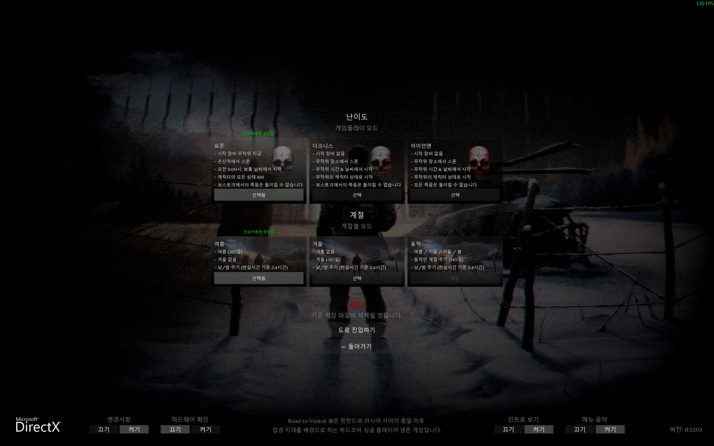
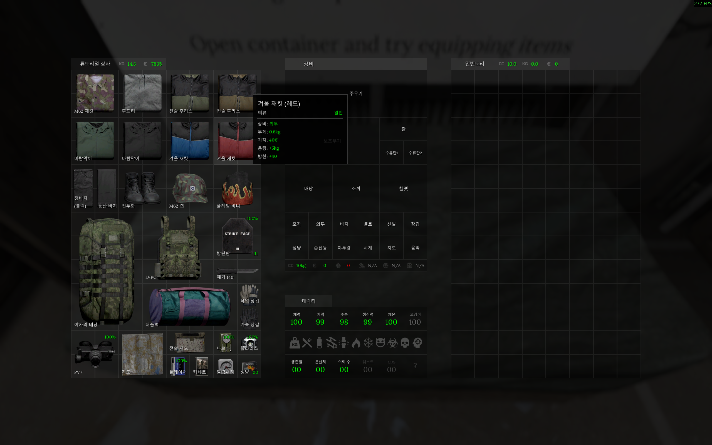

**Supported languages**

- **English** (game default)
- **Korean** (primary target)
- **French** (prototype — under testing)
- Additional languages will be added once Korean and French are
  fully validated. Languages that mix the Latin alphabet with diacritics
  (French, Português, …) need extra checks first, and the toolbox
  refactor is still ongoing.

**Compatible mods** (tested — but compatibility may not always be guaranteed)

- *Expanded Storage* by jakiepoo — <https://modworkshop.net/mod/56126>
- *Oldman's Immersive Overhaul* (ImmersiveXP) — <https://modworkshop.net/mod/50811>
- *Trader Refresh Hotkey* (temporary fix by metro) — <https://modworkshop.net/mod/55933>

---

# Trans To Vostok

A multilingual translation mod for Road to Vostok.

> **NOTE:** *This mode is currently under development. .*

- Currently supported languages: **English** (game default), **Korean**, **French** (initial machine-translated pass, in testing)
- The first development iteration based on Korean is complete; ToolBox refactoring is currently in progress alongside the addition of French and other languages.
- Detailed manuals and the ToolBox will be published on GitHub once development reaches a sufficient milestone.

## 1. Introduction

**Trans To Vostok** is a mod under development to support multilingual localization for Road to Vostok.
It aims to deliver **complete, non-missing translation** across all translatable game content — UI, items, quests, interactions, and more.

## 2. Key Features

### Main features

1. **Game Translation** (core feature)
   - Translates in-game UI, tooltips, item names, event descriptions, trader dialogue, and more.
2. **Image / Texture Translation** (added in v0.3.0)
   - Game textures replaced with localized versions at runtime — sprites, Sprite3D, and MeshInstance3D ShaderMaterial `sampler2D` parameters.
   - Scans `<locale>/textures/` recursively; paths mirror the original `res://` layout.
   - Missing files are silently skipped — original texture is kept, no crash.
   - Originals are restored on language switch (mirrors the text translator lifecycle).
   - First shipped set: Korean **Tutorial Billboard** textures (17 images).
   - **Note**: Translated textures were hand-crafted (reconstructed), and may include hand-drawn work and/or copyright-free assets, so some icons may differ slightly from the originals (e.g., Performance icon, Permadeath skull icon on the Tutorial Billboards).
3. **UI Support**
   - Opens a language selection UI via the **`F9`** hotkey.
   - Switch languages at runtime without restarting the game.
   - Performance options (batch size / interval), Whitelist toggles, Mod-compatibility addon toggles, and the optional Substr Mode are all configured here.
4. **Priority Whitelist** (added in v0.3.1)
   - Optional path-keyword presets that force per-frame priority translation for specific UI areas (HUD map label, inventory, trader UI, etc.).
   - Intended for mod compatibility — when another mod periodically overwrites in-game text and the default batch cycle can't keep up (e.g. flicker), enabling the relevant preset eliminates it.
   - All presets default OFF. Toggle via the **Whitelist** tab in the F9 UI. Per-preset state persists to `user://trans_to_vostok.cfg`.
5. **Mod Compatibility Addons** (added in v0.5.0)
   - Per-mod runtime helpers that handle label patterns introduced by other mods (e.g. prefixes prepended to every tooltip).
   - First addon: **ImmersiveXP** (Oldman's Immersive Overhaul) — strips the `\n.\n` / `\n\n` interact-dot prefix before lookup so the inner text is translated through all match tiers, then reattaches the prefix to the result.
   - Toggle in the **Addons** tab of the F9 UI. Default all OFF — enable only for mods you actually have installed. State persists to `user://trans_to_vostok.cfg`.

### Internal mechanics

6. **Text Position Realignment**
   - When translation changes text length, **on-screen layout can shift** (e.g., `A: B` layouts like tooltip's "Weight: 0.8kg").
   - This mod measures the translated label's actual font width and auto-adjusts the Value node's offset.
     - Targets: `Label` nodes with a child `Value` Label (manual positioning)
     - Auto-aligns "label: [value]" patterns in Tooltip, inventory stats, etc.
     - **Disabled in Substr Mode** — avoids interfering with game scene structure.
7. **1:1 Property-Based Translation** (Precision Matching)
   - Instead of simple text substitution, translation targets are specified directly via **Godot node structural identifiers**:
   - ``(location, parent, name, type, text) → translation``
     - `location`: Scene file path (e.g., `UI/Interface`)
     - `parent`: Parent node path within the scene (e.g., `Tools/Notes`)
     - `name`: Node name (e.g., `Hint`)
     - `type`: Godot node class (e.g., `Label`)
     - `text`: Original source text
   - **The same word can be translated differently depending on which UI/node it appears in** — prevents mismatches, enables context-aware translation.
     - Example: NVG (Night Vision Goggle) can show the full name in settings but "NVG" everywhere else.
8. **N-Tier Fallback Matching**
   - Looks up translations through 9 tiers, from specific context to generic substitution:

   | Tier | Match Method                          | Notes                                |
   | ---- | ------------------------------------- | ------------------------------------ |
   | 1    | **static exact** — all 5 fields match | All fields match exactly             |
   | 2    | **scoped literal exact**              | Dynamic text (runtime assignment)    |
   | 3    | **scoped pattern exact**              | Regex + scene context                |
   | 4    | **literal global**                    | Full text match (global)             |
   | 5    | **pattern global**                    | Regex (global)                       |
   | 6    | **static score**                      | Partial context match (+8/+4/+2/+1)  |
   | 7    | **scoped literal score**              | Dynamic text, partial context        |
   | 8    | **scoped pattern score**              | Regex + partial context              |
   | 9    | **substr**                            | Substring substitution (last resort) |
9. **Substr Mode** (renamed from "Compatibility Mode" in v0.5.0; not recommended for normal use)
   - Temporary fallback when a game update breaks the structural matching used by tiers 1–8.
   - Promotes every literal/static entry to substr fallback so partial-match coverage is wider.
   - Lower precision (false positives possible) — only enable if many texts go untranslated after a game update, while waiting for the mod to be updated.
   - Toggle on/off via checkbox in the F9 UI.

## 3. Installation

> **NOTE:** This mod requires a mod loader such as MetroModLoader.

1. Install **MetroModLoader** or **VostokMods** for Godot: https://modworkshop.net/mod/55623
2. Download `Trans To Vostok.zip` and copy it into the game's `mods/` folder.
   e.g., `C:\Program Files (x86)\Steam\steamapps\common\Road to Vostok\mods\`
   or: `D:\SteamLibrary\steamapps\common\Road to Vostok\mods\`
3. Launch the game — it starts in the default language (English).
4. Press **F9** to open the language selection UI and switch to your preferred language.
5. If some text **flickers** while another mod is active, open F9 → **Whitelist** tab and enable the relevant preset (e.g., *HUD Map Label* for ImmersiveXP).
   - This stems from the other mod refreshing a specific label every frame.
   - The **Whitelist** is a checklist that marks specific UI areas as "always re-translate every frame", so flicker no longer occurs on those areas.
6. If some text **isn't translating properly** while another mod is active, open F9 → **Addons** tab and enable the relevant addon (e.g., *ImmersiveXP* — handles the `\n.\n` / `\n\n` tooltip prefix).

## 4. Supported Languages

1. **English**: The game's default language.
2. **Korean (한국어)**: First development iteration complete. Both text and texture translation included.
3. **French (Français)**: Added in v0.4.0 — initial pass via DeepL machine translation (text only; texture translation not yet shipped). Currently maintained internally; the public repository and contribution flow for community refinement are still being prepared.
4. Other languages will be supported gradually as the ToolBox refactor finishes.

To request additional languages, please submit a GitHub issue (to be published).

## 5. TODO (Roadmap)

### 5.1. Feature Implementation

* [X] Runtime translation engine prototype (N-tier fallback)
* [X] Prototype development targeting game version 1.0.0
* [X] Language selection UI added
* [X] Text position realignment added
* [X] Performance options added to UI (added in v0.2.0)
* [X] Partial image replacement support — runtime texture loader + Korean Tutorial billboards (added in v0.3.0)
* [X] Priority whitelist — per-frame translation presets for mod compatibility, F9 UI toggles (added in v0.3.1)
* [X] Testing current mod build against game 1.0.0
* [ ] Additional language prototypes + testing against game 0.1.1.3
* [ ] Texture metadata list + validation (TODO carried over from v0.3.0)
* [ ] User-custom whitelist keyword input for unverified mods (TODO carried over from v0.3.1)
* [ ] Translator optimization
* [ ] Debug mode (planned)

### 5.2. Translation Support

* [X] Complete translation template based on Korean
* [X] After template cleanup, provide temporary machine-translated support for other languages — DeepL pipeline + French initial pass landed in v0.4.0
* [ ] Publish translation ToolBox prototype on GitHub (in progress)
* [ ] Recruit translators or collaborate via GitHub (pending public repo)
* [ ] Publish ToolBox and manual prototype on GitHub
* [ ] Create branches for additional languages — French shipped in v0.4.0; Japanese, Chinese, German, etc. pending
* [ ] Design translation workflow for stable / beta game branches (version-specific diffs, release tagging, side-by-side maintenance)

## 6. Attribution

Translated texture assets (images) are made from a mix of hand-crafted work, license-free assets, and third-party data sources. Per-file source credits are listed in **`Trans To Vostok/<locale>/Texture_Attribution.md`** inside the mod zip — auto-generated from each locale's `Texture.xlsx` on every build.

Per-locale translator credit (text + texture) is in **`Trans To Vostok/<locale>/Translation_Credit.md`**. The project-wide author / translator / contributor list is in `AUTHORS.md` at the repository root.

---

## Developer/Translator's ToolBox (Not released yet)

The mod repository includes **Python tools** for the translation pipeline.

**Setup**: `pip install -r tools/requirements.txt` (Python deps).
**`gdre_tools`** is a separate third-party tool — download manually from [bruvzg/gdsdecomp releases](https://github.com/bruvzg/gdsdecomp/releases) and place `gdre_tools.exe` at `tools/3rd_party/gdre_tools/gdre_tools.exe`.

> **NOTE:** To avoid EULA / copyright / security concerns, `set_requirements.py` and `unpack_and_decompile_pck.bat` will be removed from the repository before public release.

### Entry-point tools (run directly)

| Tool                              | Role                                                                                            |
| --------------------------------- | ----------------------------------------------------------------------------------------------- |
| `build_mod_package.py`            | Build final mod zip package (incl. `textures/`)                                                 |
| `parse_translatables.py`          | Run all three text-extraction parsers (`parse_tscn` / `parse_tres` / `parse_gd`) sequentially   |
| `machine_translation_deepl.py`    | Run the full DeepL pipeline (export → translate → import) for a target locale                  |
| `validate_translation.py`         | xlsx schema / duplicate / match validation                                                      |
| `check_untranslated.py`           | Translation gap / coverage report (also reports `DRIFTED` rows since v0.4.0)                    |
| `check_duplicate.py`              | Pre-build duplicate key detector (xlsx-only)                                                    |
| `check_conflict.py`               | Conflict check (same source text, different translations)                                       |
| `check_old_translation.py`        | Detect stale translations from removed game content                                             |
| `unpack_and_decompile_pck.bat`    | (To be removed — see NOTE above) Local dev helper for decompiling a locally-owned PCK           |

### Utilities (`tools/utils/` — invoked by entry-point tools above)

| Tool                                | Role                                                                                            |
| ----------------------------------- | ----------------------------------------------------------------------------------------------- |
| `utils/parse_tscn_text.py`          | Parse `.tscn` scene files for translatable text                                                 |
| `utils/parse_tres_text.py`          | Parse `.tres` resource files for translatable text                                              |
| `utils/parse_gd_text.py`            | Parse `.gd` scripts for UI strings                                                              |
| `utils/export_unique_text.py`       | Extract deduplicated source texts from a locale's xlsx (Translation/Texture/Glossary)           |
| `utils/translate_with_deepl.py`     | DeepL API caller with placeholder protection + XML-escape                                       |
| `utils/import_translations.py`      | Write DeepL results back into the locale's xlsx files                                           |
| `utils/build_runtime_tsv.py`        | Build runtime TSV from xlsx                                                                     |
| `utils/build_attributions.py`       | Generate `Texture_Attribution.md` from `Texture.xlsx`                                           |
| `utils/build_translation_credit.py` | Generate `Translation_Credit.md` per locale                                                     |
| `utils/build_authors.py`            | Update the auto-generated Translators section of `AUTHORS.md`                                   |
| `utils/build_translation_tsv.py`    | Export each locale xlsx to per-sheet TSV under `Translation_TSV/` (git-diff visibility)         |

**Detailed ToolBox manual will be published on GitHub after development is complete.**

---

## Technical Structure

- **Runtime text engine**: `translator.gd` (GDScript autoload)
- **Runtime texture engine**: `texture_loader.gd` (GDScript, lifecycle-managed by `translator_ui.gd`)
- **UI**: `translator_ui.gd` (language selection UI triggered by F9)
- **Text data**: `<locale>/runtime_tsv/translation_*.tsv` (built from xlsx)
- **Image data**: `<locale>/textures/**/*.png` (mirrors `res://` layout)
- **Matching approach**: 1:1 mapping based on Godot node structure (see the header comment in [`translator.gd`](translator.gd) for details)

## License

> **Status**: The repository is not yet public, so the license terms are still being finalized. The structure below reflects the current intent; the wording / specific licenses may be revised before the public release.

This repository uses different licenses by asset type. See [`LICENSE.md`](LICENSE.md) for the master overview.

| Asset                                    | License    | File                                        |
| ---------------------------------------- | ---------- | ------------------------------------------- |
| Code (Python tools, GDScript, batch)     | Apache 2.0 | [`LICENSE-CODE`](LICENSE-CODE)               |
| Translation text (Translation, Glossary) | CC BY 4.0  | [`LICENSE-TRANSLATION`](LICENSE-TRANSLATION) |
| Texture / image assets                   | CC BY 4.0  | [`LICENSE-TEXTURE`](LICENSE-TEXTURE)         |

Attribution preserved per Apache 2.0 §4(d) is in [`NOTICE`](NOTICE); the contributor list referenced by `NOTICE` and the CC BY 4.0 licenses is in [`AUTHORS.md`](AUTHORS.md). The original Road to Vostok game's English source text and original assets remain the copyright of the game developers and are NOT licensed by this repository.

## Contributing

> **Status**: The contribution flow is not yet open — the public repository is still being prepared. The guide below describes the intended workflow; [`CONTRIBUTING.md`](CONTRIBUTING.md) and related contribution guides are still being prepared before the public release.

See [`CONTRIBUTING.md`](CONTRIBUTING.md) for the contribution flow (translator / texture worker / code contributor) and the DeepL machine-translation pipeline walkthrough.

## Contact

> **Status**: GitHub issues are not yet available (repository pending public release). For now, please use the mod distribution channel.

Please reach out via GitHub issues (to be published) or the mod distribution channel.

========================================

**지원 언어**

- **English** (게임 기본언어)
- **Korean** (메인 타깃)
- **French** (프로토타입 — 테스트 중)
- 한국어/프랑스어 검증 완료 후 다른 언어를 점진적으로 추가할 예정.
  라틴 알파벳에 발음 부호가 섞이는 언어 (French, Português 등) 의
  사전 점검과 ToolBox 리팩토링이 함께 진행 중.

**호환 모드** (테스트 됨 — 호환성이 항상 보장되지는 않을 수 있음)

- *Expanded Storage* by jakiepoo — <https://modworkshop.net/mod/56126>
- *Oldman's Immersive Overhaul* (ImmersiveXP) — <https://modworkshop.net/mod/50811>
- *Trader Refresh Hotkey* (metro 의 임시 fix) — <https://modworkshop.net/mod/55933>

---

# Trans To Vostok

Road to Vostok의 다국어 번역 지원 모드.

> **NOTE:** *해당 모드는 현재 개발중에 있습니다.*

- 현재 지원 언어: **English** (게임 기본언어), **Korean**, **French** (DeepL 1차 기계번역, 테스트 중)
- 한국어를 기준으로 1차 개발이 완료되었으며, French 등 다른 언어 추가와 ToolBox 리팩토링이 함께 진행 중.
- 개발이 어느 정도 완료되면 GitHub에 자세한 메뉴얼과 ToolBox 등을 공개할 예정입니다.

## 1. 소개

**Trans To Vostok**는 Road to Vostok의 다국어 지원을 위해 개발 중인 모드입니다.
UI, 아이템, 퀘스트, 상호작용 등 **게임 내 번역 가능한 부분을 누락 없이 최대한 무결성 번역**하는 것을 목표로 합니다.

## 2. 주요 기능

### 메인 기능

1. 게임 번역 (기본 기능)
   - 게임 내 UI, 툴팁, 아이템 이름, 이벤트 설명, 트레이더 대사 등을 번역.
2. 이미지 / 텍스처 번역 (v0.3.0에서 추가)
   - 게임 텍스처를 로케일별 번역본으로 런타임에 교체 — 스프라이트, Sprite3D, MeshInstance3D 의 ShaderMaterial `sampler2D` 파라미터 지원.
   - `<locale>/textures/` 디렉토리를 재귀 스캔. 경로는 원본 `res://` 구조를 그대로 미러링.
   - 번역 파일이 없으면 조용히 스킵 — 크래시 없이 원본 텍스처 유지.
   - 언어 전환 시 원본 복원 (텍스트 translator 와 동일한 라이프사이클).
   - 최초 적용: 한국어 **튜토리얼 빌보드** 텍스처 17장.
   - **참고**: 번역 텍스처는 수작업으로 재구성(hand-crafted)되었으며, 직접 그린 작업물(hand-drawing) 또는 저작권이 없는 애셋이 포함될 수 있어 일부 아이콘이 원본과 조금 다를 수 있음 (예: 튜토리얼 빌보드의 Performance 아이콘, Permadeath 해골 아이콘 등).
3. UI 지원
   - **단축키 `F9`** 로 언어 선택 UI 표시.
   - 게임 재시작 없이 런타임에 언어 전환 가능.
   - 성능 옵션 (배치 크기 / 간격), Whitelist 토글, Mod 호환성 addon 토글, 그리고 옵션인 Substr Mode 모두 이 UI 에서 설정.
4. 우선 순위 화이트리스트 (v0.3.1에서 추가)
   - 특정 UI 영역(HUD 맵 이름, 인벤토리, 트레이더 UI 등)을 매 프레임 번역으로 승격시키는 경로 키워드 프리셋.
   - 모드 호환성을 위한 기능 — 다른 모드가 게임 텍스트를 주기적으로 덮어써 기본 batch cycle 이 따라잡지 못하는 경우 (예: 깜빡임), 해당 프리셋을 활성화하면 사라짐.
   - 모든 프리셋은 기본 OFF. F9 UI 의 **Whitelist** 탭에서 토글하며, 상태는 `user://trans_to_vostok.cfg` 에 저장됨.
5. Mod 호환성 Addons (v0.5.0에서 추가)
   - 다른 모드가 도입한 라벨 패턴 (예: tooltip 마다 prepend 되는 prefix) 을 처리하는 mod 별 런타임 helper.
   - 첫 addon: **ImmersiveXP** (Oldman's Immersive Overhaul) — `\n.\n` / `\n\n` interact-dot prefix 를 lookup 전에 strip → inner text 가 모든 매칭 tier 를 통과 → 결과에 prefix 재부착.
   - F9 UI 의 **Addons** 탭에서 토글. 기본 모두 OFF — 사용자가 실제로 사용 중인 mod 만 활성화. 상태는 `user://trans_to_vostok.cfg` 에 저장됨.

### 내부 동작

6. 문자 위치 재정렬
   - 번역으로 텍스트 길이가 달라질 경우 **실제 화면 위치가 어긋날 수 있음** (예: 툴팁의 "Weight: 0.8kg" 같은 `A: B` 레이아웃).
   - 번역된 라벨의 실제 폰트 너비를 측정하여 Value 노드의 offset 을 자동 재조정.
     - 대상: `Label` 노드 + 자식 `Value` Label (수동 위치)
     - Tooltip, 인벤토리 스탯 등의 "라벨: [값]" 패턴 자동 정렬
     - **Substr Mode 에서는 비활성** — 게임 씬 구조에 간섭하지 않음.
7. 게임 내 property 와 1대1 매칭 번역 (정밀 매칭)
   - 단순 text 치환이 아니라 **Godot 노드의 구조적 식별자**로 번역 대상을 직접 지정:
   - ``(location, parent, name, type, text) → translation``
     - `location`: 씬 파일 경로 (예: `UI/Interface`)
     - `parent`: 씬 내 부모 노드 경로 (예: `Tools/Notes`)
     - `name`: 노드 이름 (예: `Hint`)
     - `type`: Godot 노드 클래스 (예: `Label`)
     - `text`: 원문
   - **같은 단어라도 어느 UI 의 어느 노드에 있는지에 따라 다르게 번역** 가능 — 오매칭 방지, 문맥별 번역 지원.
     - 예: NVG (Night Vision Goggle) — 설정에서는 풀네임, 그 외에는 NVG 로 표시.
8. N-Tier Fallback 매칭
   - 구체적 컨텍스트부터 일반 치환까지 9 단계로 조회:

   | Tier | 매칭 방식                             | 비고                             |
   | ---- | ------------------------------------- | -------------------------------- |
   | 1    | **static exact** — 5개 필드 완전 일치 | 모든 필드가 완벽하게 일치        |
   | 2    | **scoped literal exact**              | 동적 텍스트 (코드 할당)          |
   | 3    | **scoped pattern exact**              | 정규식 + 씬 컨텍스트             |
   | 4    | **literal global**                    | 텍스트 완전 일치 (전역)          |
   | 5    | **pattern global**                    | 정규식 (전역)                    |
   | 6    | **static score**                      | 부분 컨텍스트 매칭 (+8/+4/+2/+1) |
   | 7    | **scoped literal score**              | 동적 텍스트 부분 컨텍스트        |
   | 8    | **scoped pattern score**              | 정규식 + 부분 컨텍스트           |
   | 9    | **substr**                            | 부분 문자열 치환 (최후 fallback) |
9. Substr Mode (v0.5.0 에서 "Compatibility Mode" 에서 rename; 일반 사용에는 권장되지 않음)
   - 게임 업데이트로 tier 1~8 의 구조 매칭이 깨졌을 때의 임시 fallback.
   - 모든 literal/static entry 를 substr fallback 에도 추가해 부분 매치 적용 범위 확장.
   - 정밀도가 낮음 (false positive 가능) — 게임 업데이트 후 다수 텍스트가 번역되지 않을 때, 모드 업데이트 전까지의 임시 사용용.
   - F9 UI 의 체크박스로 on/off.

## 3. 설치

> **NOTE:** 해당 모드는 MetroMoadLoader 등의 모드로더를 요구합니다.

1. Godot용 **MetroModLoader** 또는 **VostokMods**가 설치되어 있어야 합니다. https://modworkshop.net/mod/55623
2. `Trans To Vostok.zip` 파일을 다운로드 받은 후, 게임의 `mods/` 폴더에 복사합니다.
   예: `` C:\Program Files (x86)\Steam\steamapps\common\Road to VostokTrans To Vostok\mods\``
   또는: ``D:\SteamLibrary\steamapps\common\Road to Vostok\mods\``
3. 게임을 실행하면 기본 언어(English)로 시작됩니다.
4. **F9** 키로 언어 선택 UI를 열어 원하는 언어로 전환합니다.
5. 다른 모드와 함께 사용 중 **일부 텍스트가 깜빡거린다면**, F9 → **Whitelist** 탭에서 해당 프리셋 활성화 (예: ImmersiveXP 의 경우 *HUD Map Label*).
   - 이는 해당 모드가 특정 텍스트 라벨을 매 프레임마다 갱신하는 문제에서 비롯됩니다.
   - **Whitelist** 는 매 프레임 갱신되는 항목에 대해 "매 프레임마다 계속 재번역"해야 할 대상을 표시하는 체크리스트입니다. (=깜빡임 문제 해소)
6. 다른 모드와 함께 사용 중 **일부 텍스트가 제대로 번역되지 않는다면**, F9 → **Addons** 탭에서 해당 addon 활성화 (예: *ImmersiveXP* — `\n.\n` / `\n\n` tooltip prefix 처리).

## 4. 지원 언어

1. English: 게임의 기본 언어입니다.
2. 한국어 (Korean): 1차 개발 완료. 텍스트 + 텍스처 번역 모두 포함.
3. 프랑스어 (French / Français): v0.4.0 에 추가됨 — DeepL 로 1차 기계번역 (텍스트만 적용; 텍스처 번역은 아직 미포함). 현재 내부에서 관리 중이며, 커뮤니티 검수/보정용 공개 저장소 및 기여 흐름은 준비 중.
4. 그 외 다른 언어는 ToolBox 정리가 마무리되는 대로 점진적으로 지원해 나갈 계획입니다.

추가 언어 지원을 원하시면 GitHub 이슈로 요청해 주세요. (차후 공개 예정)

## 5. TODO (로드맵)

### 5.1. 기능 구현

* [X] 런타임 번역 엔진 프로토타입 임시 구현 (N-tier fallback)
* [X] 1.0.0 버전을 대상으로 번역 모드 Prototype 개발
* [X] 언어 선택 UI 추가
* [X] 문자 위치 재정렬 기능 추가
* [X] UI에 성능 옵션 추가 (v0.2.0에 추가됨)
* [X] 일부 이미지 교체 기능 — 런타임 텍스처 로더 + 한국어 튜토리얼 빌보드 (v0.3.0에 추가됨)
* [X] 우선 순위 화이트리스트 — 모드 호환용 매 프레임 번역 프리셋, F9 UI 토글 (v0.3.1에 추가됨)
* [X] 현재 개발된 모드를 게임 1.0.0 버전에 대한 테스트
* [ ] 기타 언어 프로토타입 추가 및 게임 0.1.1.3 버전에 대한 테스트
* [ ] 텍스처 메타데이터 리스트 + 검증 도구 업데이트 (v0.3.0 에서 추가된 TODO)
* [X] 확인되지 않은 모드에 대응할 수 있도록 사용자 커스텀 whitelist 키워드 입력 (v0.3.1 에서 추가된 TODO)
* [ ] 번역기 최적화
* [ ] 디버그 모드 추가 (예상)

### 5.2. 번역 지원

* [X] Korean 번역을 기준으로 번역 템플릿 완성
* [X] 번역 Template 정리 후, 기계번역 등을 이용해 다른 언어에 대한 임시 지원 추가 — DeepL 파이프라인 + 프랑스어 1차 번역 v0.4.0 적용
* [ ] 번역 ToolBox 프로토타입 GitHub 공개 및 관리 (진행 중)
* [ ] 번역가 모집 또는 GitHub를 통한 협업 (공개 저장소 준비 후)
* [ ] ToolBox 및 메뉴얼 Prototype 완성 후 GitHub 공개
* [ ] 추가 언어 지원  Branch 생성 — 프랑스어 v0.4.0 적용; 일본어, 중국어, 독일어 등 대기
* [ ] 정식 / 베타 버전에 대한 번역 workflow 설계 (버전별 diff, 릴리스 태깅, 양쪽 동시 유지)

## 6. 출처 표기 (Attribution)

번역된 텍스처(이미지) 에셋은 직접 작업물 / 라이선스-프리 애셋 / 제3자 데이터 출처가 혼합되어 있습니다. 각 파일별 출처는 모드 zip 안의 **`Trans To Vostok/<locale>/Texture_Attribution.md`** 에 정리되어 있으며, 빌드 시 각 로케일의 `Texture.xlsx` 에서 자동 생성됩니다.

로케일별 번역자 credit (텍스트 + 텍스처) 는 **`Trans To Vostok/<locale>/Translation_Credit.md`** 에 정리되어 있습니다. 프로젝트 전체 저자 / 번역자 / 기여자 명단은 저장소 루트의 `AUTHORS.md` 입니다.

---

## 개발자/번역가용 ToolBox (아직 공개 안됨)

모드 저장소에는 번역 파이프라인 구축용 **Python 도구**가 포함되어 있습니다.

**환경 준비**: `pip install -r tools/requirements.txt` (Python 의존성).
**`gdre_tools`** 는 별도 third-party 도구로, [bruvzg/gdsdecomp releases](https://github.com/bruvzg/gdsdecomp/releases)에서 직접 다운로드하여 `gdre_tools.exe` 를 `tools/3rd_party/gdre_tools/gdre_tools.exe` 위치에 두세요.

> **NOTE:** EULA / 저작권 / 보안 문제 예방을 위해 `set_requirements.py` 와 `unpack_and_decompile_pck.bat` 은 공개 전 저장소에서 제거될 예정입니다.

### 진입점 도구 (직접 실행)

| 도구                              | 역할                                                                                            |
| --------------------------------- | ----------------------------------------------------------------------------------------------- |
| `build_mod_package.py`            | 최종 모드 zip 패키지 빌드 (`textures/` 포함)                                                    |
| `parse_translatables.py`          | 텍스트 추출 파서 3 종 (`parse_tscn` / `parse_tres` / `parse_gd`) 일괄 실행                      |
| `machine_translation_deepl.py`    | 대상 로케일에 대해 DeepL 파이프라인 (export → translate → import) 일괄 실행                   |
| `validate_translation.py`         | xlsx 스키마 / 중복 / 매칭 검증                                                                  |
| `check_untranslated.py`           | 번역 누락 / 커버리지 리포트 (v0.4.0 부터 `DRIFTED` 행도 보고)                                   |
| `check_duplicate.py`              | 빌드 전 중복 키 사전 검사 (xlsx 단독)                                                           |
| `check_conflict.py`               | 번역 충돌 검사 (같은 원문 다른 번역)                                                            |
| `check_old_translation.py`        | 게임 업데이트로 사라진 옛 번역 감지                                                             |
| `unpack_and_decompile_pck.bat`    | (제거 예정 — 위 NOTE 참조) 로컬 개발 편의 스크립트, 본인이 소유한 PCK 디컴파일                  |

### 유틸리티 (`tools/utils/` — 위 진입점 도구가 호출)

| 도구                                | 역할                                                                                            |
| ----------------------------------- | ----------------------------------------------------------------------------------------------- |
| `utils/parse_tscn_text.py`          | `.tscn` 씬 파일을 파싱해 번역 대상 텍스트 추출                                                  |
| `utils/parse_tres_text.py`          | `.tres` 리소스 파일을 파싱해 번역 대상 텍스트 추출                                              |
| `utils/parse_gd_text.py`            | `.gd` 스크립트를 파싱해 UI 문자열 추출                                                          |
| `utils/export_unique_text.py`       | 로케일 xlsx (Translation/Texture/Glossary) 에서 dedup 된 source 텍스트 추출                     |
| `utils/translate_with_deepl.py`     | DeepL API 호출 도구 (placeholder 보호 + XML escape)                                             |
| `utils/import_translations.py`      | DeepL 결과를 로케일 xlsx 에 반영                                                                |
| `utils/build_runtime_tsv.py`        | xlsx → 런타임 TSV 빌드                                                                          |
| `utils/build_attributions.py`       | `Texture.xlsx` → `Texture_Attribution.md` 생성                                                  |
| `utils/build_translation_credit.py` | 로케일별 `Translation_Credit.md` 생성                                                           |
| `utils/build_authors.py`            | `AUTHORS.md` 의 자동 생성 Translators 섹션 갱신                                                 |
| `utils/build_translation_tsv.py`    | 각 로케일 xlsx 를 시트별 TSV 로 export (`Translation_TSV/`, git diff 가독성)                    |

**ToolBox 상세 매뉴얼은 개발 완료 후 GitHub에 공개됩니다.**

---

## 기술 구조

- **런타임 텍스트 엔진**: `translator.gd` (GDScript autoload)
- **런타임 텍스처 엔진**: `texture_loader.gd` (GDScript, 라이프사이클은 `translator_ui.gd` 가 관리)
- **UI**: `translator_ui.gd` (F9 단축키로 표시되는 언어 선택 UI)
- **텍스트 데이터**: `<locale>/runtime_tsv/translation_*.tsv` (xlsx에서 빌드)
- **이미지 데이터**: `<locale>/textures/**/*.png` (원본 `res://` 구조 미러링)
- **매칭 방식**: Godot 노드 구조 기반 1:1 매핑 (자세한 내용은 [`translator.gd`](translator.gd) 상단 주석 참고)

## 라이선스

> **상태**: 저장소가 아직 공개 전이라 라이선스 내용은 정리 중입니다. 아래 구조는 현재 의도이며, 공개 시점에 표현 / 구체 라이선스가 수정될 수 있습니다.

본 저장소는 자산 유형별로 다른 라이선스를 사용합니다. 마스터 개요는 [`LICENSE.md`](LICENSE.md) 참고.

| 자산                                 | 라이선스   | 파일                                        |
| ------------------------------------ | ---------- | ------------------------------------------- |
| 코드 (Python tools, GDScript, batch) | Apache 2.0 | [`LICENSE-CODE`](LICENSE-CODE)               |
| 번역 텍스트 (Translation, Glossary)  | CC BY 4.0  | [`LICENSE-TRANSLATION`](LICENSE-TRANSLATION) |
| 텍스처 / 이미지 자산                 | CC BY 4.0  | [`LICENSE-TEXTURE`](LICENSE-TEXTURE)         |

Apache 2.0 §4(d) 에 의한 attribution 보존 대상은 [`NOTICE`](NOTICE) 에 있고, `NOTICE` 와 CC BY 4.0 라이선스가 참조하는 기여자 명단은 [`AUTHORS.md`](AUTHORS.md) 에 있습니다. 원작 Road to Vostok 게임의 영문 텍스트와 원본 자산은 게임 개발자의 저작권으로 남으며 본 저장소의 라이선스 대상이 아닙니다.

## 기여하기

> **상태**: 기여 흐름은 아직 개방 전입니다 — 공개 저장소 준비 중. 아래 안내는 의도된 워크플로우이며, [`CONTRIBUTING.md`](CONTRIBUTING.md) 등 기여 관련 가이드는 공개 전까지 준비 중입니다.

기여 흐름 (번역자 / 텍스처 작업자 / 코드 기여자) 과 DeepL 기계번역 파이프라인 워크스루는 [`CONTRIBUTING.md`](CONTRIBUTING.md) 참고.

## 문의

> **상태**: GitHub 이슈는 아직 사용 불가 (저장소 공개 대기 중). 현재는 모드 배포 채널을 통해 문의 부탁드립니다.

GitHub 이슈(추후 공개) 또는 모드 배포 채널을 통해 문의해 주세요.

# ScreenShots

**Trans to Vostok**

**MetroModLoaderUI**

